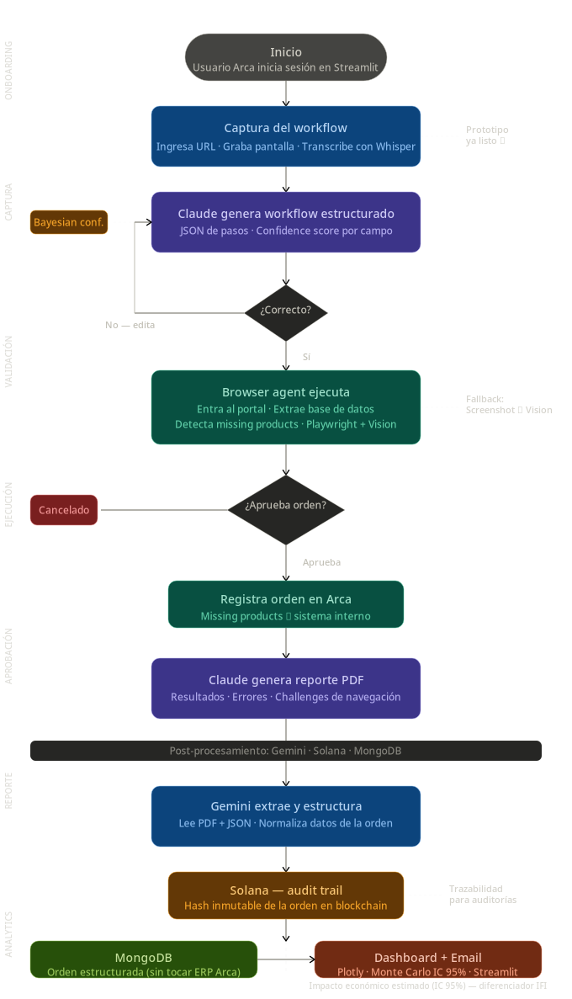

# ArcFast ⚡
> Agente IA que automatiza la captura de órdenes de compra entre portales de clientes y el sistema interno de Arca Continental.

El agente observa al usuario realizar el proceso **una sola vez**, aprende el mapeo de campos sin reglas hardcodeadas, y lo ejecuta de forma autónoma con nuevos datos.

---

## Diagrams




---

## Estructura del repo

```
ArcFast/
├── backend/
│   └── api.py                  # FastAPI — endpoints async, auth por token, sesiones aisladas
├── brain/                      # ★ Módulo central unificado (reemplaza cerebro/ + core/)
│   ├── __init__.py
│   ├── procesar.py             # Cerebro async: análisis, preguntas inteligentes, retry
│   └── workflow_generator.py   # Transcripción → workflow JSON + Bayesian confidence
├── browser_agent/
│   ├── agent.py                # Browser agent async (browser_use + Playwright fallback)
│   └── grabador.py             # Grabador de pantalla + audio (mouse, teclado, screenshots)
├── core/                       # Shims de compatibilidad → redirigen a brain/
│   ├── procesar.py
│   └── workflow_generator.py
├── database/
│   └── db.py                   # SQLite (compatible SQL Server) — sin credenciales en DB
├── frontend/
│   ├── app.py                  # Streamlit UI (modo alternativo)
│   └── monte_carlo.py          # Simulación Monte Carlo — impacto económico IC 95%
├── frontend_web/
│   └── index.html              # UI corporativa Arca Continental (HTML/JS → FastAPI)
├── grabador/
│   └── grabador.py             # Grabador (usado por main.py en modo CLI)
├── postprocessing/
│   ├── pipeline.py             # Gemini + Solana audit trail + MongoDB + email
│   └── reporte.py              # Excel + ticket HTML
├── shared/
│   └── schemas.py              # Contrato JSON entre módulos — leer primero
├── data/
│   └── mock/
│       ├── mock_data.json
│       └── plan_ejemplo.json
├── arcfast.db                  # Base de datos (se genera automáticamente)
├── .env.example
└── requirements.txt
```

---

## Setup

```bash
git clone https://github.com/BladedGoose13/ArcFast.git
cd ArcFast
pip install -r requirements.txt
playwright install chromium
cp .env.example .env
# Edita .env con tus API keys
```

---

## Uso

### UI corporativa (FastAPI + HTML) — modo recomendado

```bash
uvicorn backend.api:app --reload --port 8000
```

Abre `http://localhost:8000`.

Los endpoints protegidos requieren autenticación. Usa `/auth/login` primero y pasa el `token` en el header `Authorization: Bearer <token>`.

### Modo CLI

```bash
python main.py
```

### Modo Streamlit (alternativo)

```bash
streamlit run frontend/app.py
```

---

## Flujo

```
1. Grabación    →  El usuario ejecuta el proceso y habla en voz alta
2. Análisis     →  Claude Opus analiza keyframes + audio (Fase A)  — async, con retry
3. Preguntas    →  La IA devuelve solo lo que no pudo inferir (sin input() en API)
4. Revisión     →  El usuario edita mapeos con Bayesian confidence scores
5. Ejecución    →  Browser agent navega el portal (browser_use o Playwright)
6. Aprobación   →  Human-in-the-loop antes de registrar en Arca
7. Reporte      →  Dashboard Monte Carlo + Excel + ticket HTML + email
```

---

## Base de datos

SQLite embebida con schema compatible con SQL Server. Se genera automáticamente.

| Tabla | Descripción |
|---|---|
| `planes` | Instrucciones aprendidas por portal (sin credenciales) |
| `mapeos` | Campos con confianza bayesiana actualizable |
| `sesiones` | Historial completo de ejecuciones |
| `errores` | Fallos por paso para análisis de ingeniería |

**Seguridad**: las credenciales del usuario (passwords, tokens) nunca se persisten en disco.

---

## Cambios en esta versión

| Bug | Fix |
|---|---|
| `cerebro/` y `core/` duplicados | Unificados en `brain/` — `core/` es ahora un shim de compatibilidad |
| `input()` bloqueante en FastAPI | Eliminado — las preguntas se devuelven como JSON al frontend |
| JSON parsing con crash si el modelo responde texto | Regex robusto + retry automático con re-prompt |
| `asyncio.run()` dentro de endpoints sync | Todos los endpoints relevantes son `async def` |
| Sesión global mutable (colisión multi-usuario) | Session dict por `session_id` UUID |
| Credenciales guardadas en SQLite | `_limpiar_credenciales()` en todos los puntos de escritura |
| Modelo `claude-sonnet-4-20250514` inválido | Corregido a `claude-opus-4-5` |
| Path `sesiones/plan.json` relativo al CWD | Relativo a `brain/procesar.py` via `Path(__file__)` |
| `analizar_sesion` devolvía `preguntas:[]` forzado | Devuelve las preguntas reales del modelo |
| `completar_plan` devolvía tupla | Devuelve solo el plan (dict) |
| Keyframe sampling repetía frames con pocas imágenes | Distribución uniforme sin duplicados |
| `api_key=` explícita en `ChatAnthropic` | Eliminada — lee del env automáticamente |

---

## División de trabajo

| Persona | Módulo | Archivos |
|---|---|---|
| 1 (Max) | Orquestación + Bayesian confidence | `brain/workflow_generator.py` |
| 2 | Browser agent | `browser_agent/agent.py` + `grabador.py` |
| 3 | Post-procesamiento | `postprocessing/pipeline.py` |
| 4 | Frontend + Monte Carlo | `frontend_web/index.html` + `frontend/monte_carlo.py` |
