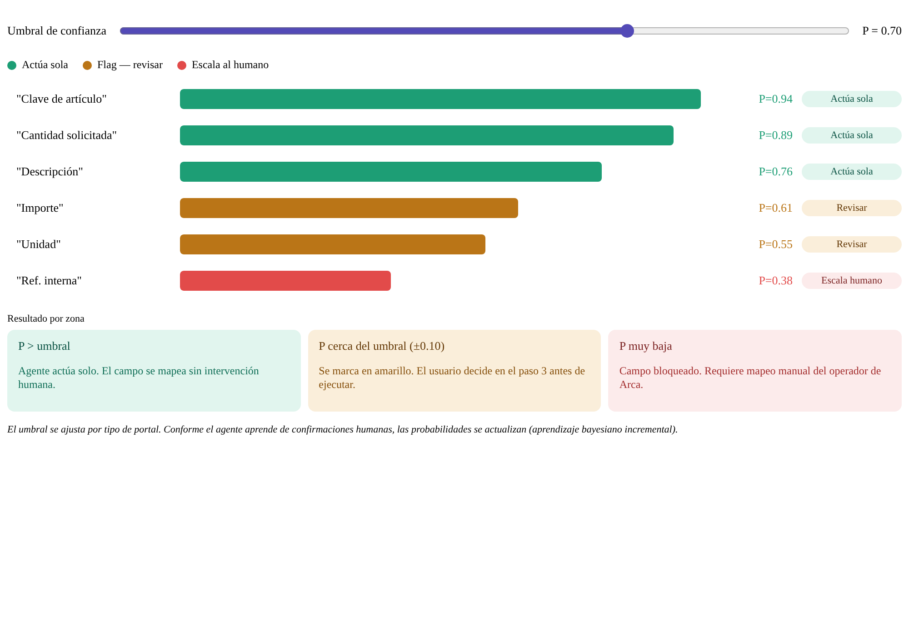

# ArcaVision ⚡

**Agente de IA que automatiza la captura de órdenes de compra entre portales de clientes y el sistema interno de Arca Continental.**

Muéstrale el proceso una sola vez. Aprende el mapeo de campos sin reglas fijas. A partir de ahí lo ejecuta solo abre el navegador, navega el portal, registra la orden y lo cierra.

&nbsp;

## El problema que resuelve

Los equipos capturan manualmente pedidos desde diversos portales copiando campo por campo al sistema interno. Es repetitivo, lento y propenso a errores.

ArcaVision elimina ese trabajo manual por completo.

&nbsp;

## Cómo funciona

El flujo completo ocurre dentro de una interfaz web — nada se configura en código.

| Etapa | Qué pasa |
|---|---|
| **1. Grabación** | El usuario ejecuta el proceso normalmente y habla en voz alta explicando qué hace |
| **2. Análisis** | Claude Opus interpreta los screenshots y el audio, genera el plan de automatización |
| **3. Preguntas** | La IA pregunta únicamente lo que no pudo inferir, credenciales, datos faltantes |
| **4. Revisión** | El usuario revisa el mapeo de campos con scores de confianza bayesiana |
| **5. Ejecución** | El agente navega el portal, extrae datos y registra la orden en Arca |
| **6. Reporte** | Se genera Excel, PDF y ticket de confirmación; se envía por email |

&nbsp;

## Tecnología

**Cerebro:** Claude Opus Vision analiza imágenes y audio simultáneamente. No usa selectores CSS ni coordenadas fijas, entiende la pantalla como lo haría una persona.

**Agente:** `browser_use` navega el portal por DOM, con límite de fallos y timeout para evitar loops. El navegador se cierra solo al terminar.

**Confianza bayesiana:** Cada campo mapeado tiene un score de probabilidad. Si el score supera el umbral, el agente actúa solo. Si está cerca del límite, lo marca para revisión. Si es muy bajo, escala al operador. El umbral mejora con cada confirmación humana.

**Auditoría:** Los registros financieros se cifran con Fernet (AES-128-CBC) en reposo y se anclan como hash SHA-256 en Solana Devnet, nadie puede alterar un pedido sin que se note.

&nbsp;

## Setup

```bash
git clone https://github.com/BladedGoose13/ArcaVision.git
cd ArcaVision
pip install -r requirements.txt
cp .env
```

Llena las variables en `.env`. El agente descarga su propio navegador la primera vez que corre.

**Levantar la interfaz:**

```bash
uvicorn backend.api:app --reload --port 8000
```

Abre `http://localhost:8000`: todo el flujo ocurre ahí.

&nbsp;

## Reportes generados

Cada ejecución produce automáticamente:

| Archivo | Contenido |
|---|---|
| `reportes/compras_arcavision.xlsx` | Registro de órdenes con gráficas |
| `reportes/reporte_ia_arcavision.pdf` | Desempeño del agente por sesión |
| `reportes/errores_arcavision.xlsx` | Análisis de fallos por tipo de acción |
| `reportes/ticket.html` | Ticket de confirmación con branding Arca |

&nbsp;

## Base de datos

SQLite embebida compatible con SQL Server. Se crea automáticamente en `arcavision.db`.

| Tabla | Qué guarda |
|---|---|
| `planes` | Flujos aprendidos por portal |
| `mapeos` | Campos con confianza bayesiana actualizable |
| `sesiones` | Historial completo de ejecuciones |
| `pedidos` | Órdenes capturadas con productos y totales |
| `errores` | Fallos por paso para análisis de ingeniería |

Para inspeccionar: extensión **SQLite Viewer** en VS Code. Para migrar a SQL Server: cambiar `get_connection()` en `database/db.py`.

&nbsp;

## Estructura del proyecto
```
ArcaVision/
├── main.py                          Entrypoint principal
├── requirements.txt
├── .gitignore
│
├── backend/
│   └── api.py                       FastAPI — conecta frontend con el agente
│
├── browser_agent/
│   ├── agent.py                     Agente browser_use con auto-cierre
│   └── grabador.py                  Captura de pantalla, audio y eventos
│
├── cerebro/
│   └── procesar.py                  Versión anterior del cerebro (legacy)
│
├── core/
│   ├── procesar.py                  Cerebro: Fase A (análisis) + Fase B (completar plan)
│   └── workflow_generator.py        Transcripción y Bayesian confidence scores
│
├── database/
│   └── db.py                        SQLite — sesiones, planes, pedidos, errores (cifrado)
│
├── frontend_web/
│   └── index.html                   UI corporativa Arca Continental (SPA con Plotly)
│
├── frontend/
│   ├── app.py                       Streamlit (modo alternativo)
│   └── monte_carlo.py               Simulación Monte Carlo con IC 95%
│
├── grabador/
│   ├── __init__.py
│   └── grabador.py                  Módulo grabador (importable)
│
├── postprocessing/
│   ├── reporte.py                   Excel, PDF, tickets, email
│   ├── pipeline.py                  Post-procesamiento + MongoDB
│   ├── crypto.py                    Cifrado Fernet AES-128 en reposo
│   └── solana_audit.py              Audit trail en Solana Devnet
│
├── shared/
│   └── schemas.py                   Contrato JSON entre módulos
│
├── scripts/
│   └── test_correo.py               Prueba email + cifrado sin correr el agente
│
├── data/
│   └── mock/
│       ├── mock_data.json
│       └── plan_ejemplo.json
│
├── diagrams/
│   ├── arca_ai_agent_workflow.png
│   └── bayesian_confidence_scoring.png
│
├── reportes/                        Generados en runtime (gitignoreados)
└── sesiones/                        Grabaciones y planes (gitignoreados)
```
&nbsp;

## División de trabajo

| Módulo | Responsable |
|---|---|
| Team lead, project architect, AI & backend engineering | Max |
| Mathematical modeling and API integration | Agatha |
| AI engineer and cloud computing | Izhar |
| Data analyst and engineer | Giancarlo |

&nbsp;

---

## Diagramas

### Flujo completo del agente


&nbsp;

### Sistema de confianza bayesiana


